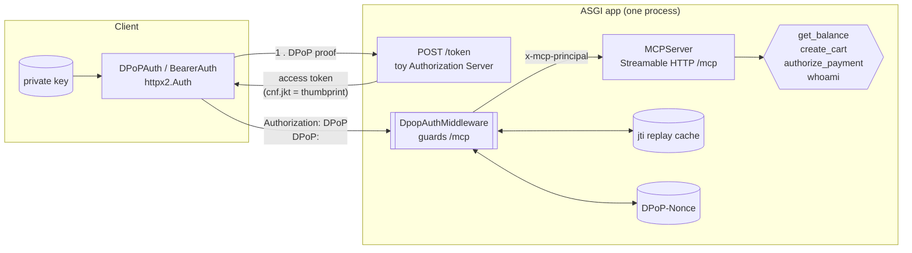
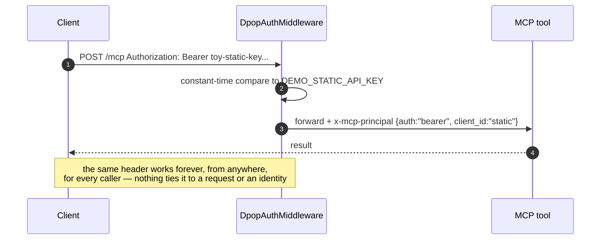
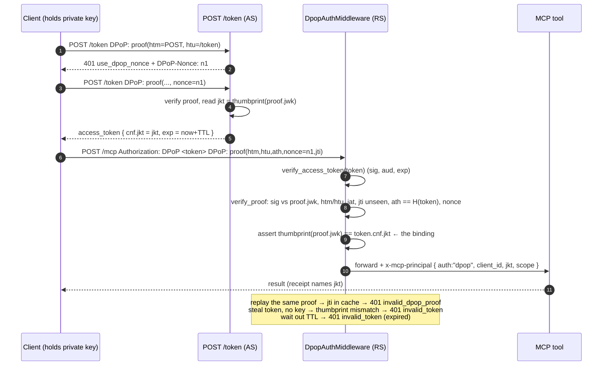

# Architecture

Everything runs in one process behind one ASGI app. The only moving parts are:

| Piece | File | Job |
|---|---|---|
| Token endpoint (`POST /token`) | `server.py` `_token_route` | Toy Authorization Server. Verifies a DPoP proof, mints a short-lived access token bound to the proof key's thumbprint. |
| Auth middleware | `auth_middleware.py` | Wraps `/mcp`. Enforces `bearer` **or** `dpop`. On success injects an `x-mcp-principal` header the tools read. |
| MCP server | `server.py` `build_mcp` | `MCPServer` (the mcp 2.x class formerly called `FastMCP`) exposing four payments tools over Streamable HTTP. |
| Crypto core | `crypto.py`, `dpop.py`, `tokens.py` | JWS/ES256, JWK + RFC 7638 thumbprint, DPoP proof create/verify, access-token mint/verify. Hand-rolled on `cryptography` so the wire format is visible. |
| Replay cache / nonce | `replay_cache.py`, `nonce.py` | `jti` seen-set; rotating server `DPoP-Nonce`. |
| Client | `client_auth.py`, `mcp_client.py` | `httpx2.Auth` implementations: fresh proof per request, automatic nonce retry. |

## Sequence — static bearer (`DPOP_MODE=bearer`)

## Sequence — DPoP (`DPOP_MODE=dpop`)

## Where the principal comes from

The MCP server never re-does auth. The middleware resolves a principal and
passes it down as a request header; `server.py::_principal_from_ctx` reads it
via `ctx.headers` (mcp exposes the underlying Starlette request headers to
tools). `whoami` echoes it; `authorize_payment` embeds `jkt` in the signed
receipt, which is the "provable attribution" the source note asks for.

See [`dpop-vs-bearer.md`](./dpop-vs-bearer.md) for the property-by-property
comparison and [`threat-model.md`](./threat-model.md) for how the five
scenarios map to MCP-T1 and to AP2's Mandate model.
