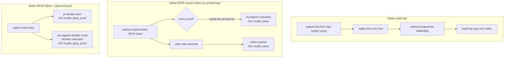

# DPoP proof-of-possession vs. a static bearer key

The source (a personal note, *Agent Identity and Authorization*) lists three
failure modes of "a static API key or a long-lived OAuth token baked into a
config file". This prototype makes each one concrete.

| Property | Static bearer key | DPoP (RFC 9449) | Demonstrated by |
|---|---|---|---|
| **Binding to the sender** | none — whoever holds the string is accepted | access token carries `cnf.jkt`; every request needs a proof signed by that key | scenario 3 |
| **Binding to the request** | none — same header for every method/URL | proof commits to `htm` + `htu`; server checks both | scenario 4 |
| **Replay** | unlimited | one-shot per `jti` inside the `iat` window; server may also pin a `DPoP-Nonce` | scenario 4 |
| **Lifetime / blast radius** | until someone notices and rotates | seconds (`DPOP_ACCESS_TOKEN_TTL`, default 30s) | scenario 5 |
| **Attribution in the audit log** | every caller is `"static"` | principal carries `client_id` + `jkt`; the payment receipt is signed over it | scenario 1 vs 2 |
| **Revocation granularity** | rotating the key breaks every client that shares it | drop one key's thumbprint / let its short token lapse; nothing else moves | scenarios 1, 5 |
| **Cost on the hot path** | one string compare | one ECDSA verify + thumbprint compare + cache lookup per call | — |

## What a stolen credential buys an attacker

## The mechanics you actually feel building it

1. **The proof is per-request.** In `client_auth.py::DPoPAuth.auth_flow` a fresh
   proof is minted for *every* outgoing HTTP request, because each MCP JSON-RPC
   message is its own POST. A bearer client sets one header and forgets it.
2. **The binding is two hashes that must match.** `thumbprint(proof.jwk)` from
   this request vs. `token.cnf.jkt` minted earlier. That single comparison
   (`auth_middleware.py`) is the whole idea.
3. **`ath` ties the proof to the token**, so a proof captured with token A
   cannot be paired with token B.
4. **The nonce is the server pinning freshness itself** instead of trusting the
   client clock — a `401 use_dpop_nonce` + `DPoP-Nonce` header, then one retry
   (`obtain_token` and `DPoPAuth` both handle it transparently).
5. **Short TTL does most of the risk reduction on its own.** Even without the
   key-binding, a 30-second token is a small window. Binding + TTL together are
   what make a leak a non-event.

## Honest limitations of this toy

- Keys live in `.dev-keys/` as plain PEM; no HSM, no attestation.
- The replay cache and nonce store are in-process — a real multi-node RS needs a
  shared store (the note's "Workload Identity Federation" bullet is about
  exactly this scaling problem).
- No refresh tokens, no client authentication at `/token`, no revocation list.
- `authorize_payment` "moves money" in a dict. The receipt is signed but there
  is no settlement, no counterparty verification — see the AP2 mapping in
  [`threat-model.md`](./threat-model.md).
