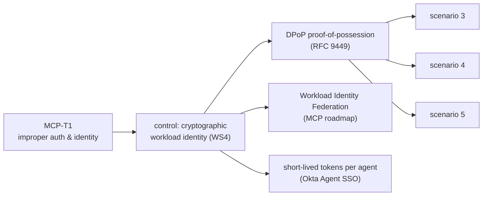

# Threat model & how it maps to the notes

## MCP-T1 — Improper authentication & identity

Personal notes on **CoSAI WS4** (*MCP-Security*, *WS4 secure agentic design*)
define **MCP-T1** and list it in the top-12, with **"strong agent identity
(cryptographic workload identity)"** as the recommended control. The five
scenarios are MCP-T1 seen from both sides:

| Scenario | Attacker capability | Server response | MCP-T1 facet |
|---|---|---|---|
| 1 `static_bearer_replay` | copied the static key | **accepts** — money moves, log says `"static"` | the vulnerability: shared secret, no sender/identity binding |
| 2 `dpop_happy_path` | — (control) | accepts; receipt names `jkt` | the control working: per-request proof-of-possession |
| 3 `dpop_stolen_token` | has the access token, not the key | `401 invalid_token` (thumbprint mismatch) | token theft neutralised by key binding |
| 4 `dpop_replayed_proof` | has token **and** a full valid proof | `401 invalid_dpop_proof` (jti replay / htu mismatch) | proof authorises one method+URI, once |
| 5 `dpop_token_expiry` | has a token, waits | `401 invalid_token` (expired) | short TTL caps the blast radius |

Also touched, not solved here: **MCP-T10** (rate limits) — a short TTL bounds
abuse per token but there is no per-principal throttle; **MCP-T12**
(logging/auditability) — `audit.log` records the resolved principal per call,
which is the thing a `"static"` key cannot give you.

## Mapping to AP2 (Google's Agent Payments Protocol)

The note frames AP2's **Mandates** as "the same idea one layer up": a signed,
bounded, after-the-fact-provable record of who authorised what.

| AP2 concept | Analogue in this prototype |
|---|---|
| **Intent Mandate** — signed rules bounding a future action (price caps, timing) | the access token: `scope` + `exp` + `cnf.jkt` bound the agent to a narrow, expiring capability |
| **Cart Mandate** — unchangeable "what you see is what you pay for" record | `create_cart` freezes line items and returns `items_hash`; `authorize_payment` refuses if `total > max_amount` and signs a receipt over the hash |
| "who authorised it / does it match intent / who's accountable" | the receipt's `authorized_by.jkt` + `proof_of_possession` flag — verifiable against the AS-issued token's `cnf.jkt` |

The prototype deliberately stops short of AP2 proper: no separate user vs. agent
keys, no delegation chain, no payment-network settlement. It shows the
*mechanism* (key-bound, short-lived, per-request-proven authority) that AP2,
Okta Agent SSO, and the MCP identity roadmap all build on.

## Residual risk in the toy itself

- PEM keys on disk in `.dev-keys/`; compromise of the client host = compromise
  of the key (DPoP protects the token in transit / at the RS, not a fully owned
  client).
- Single-node in-memory replay cache and nonce store.
- `/token` has no client authentication — any holder of a key can get a token
  for any `client_id`/`scope` it asks for.
- DNS-rebinding protection is on (mcp default for localhost hosts) but TLS is
  not; run behind TLS for anything real.
